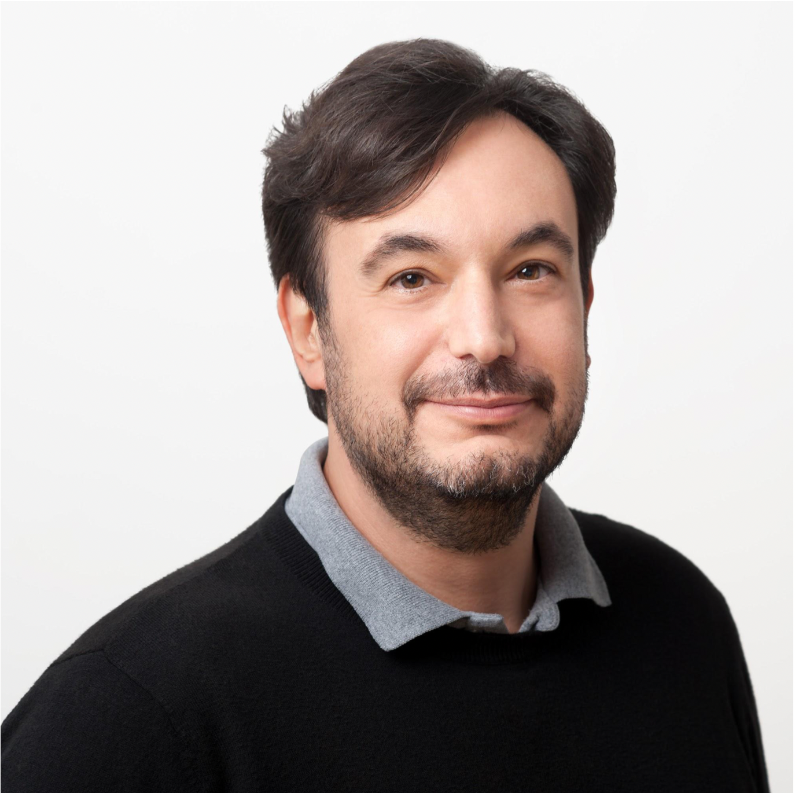
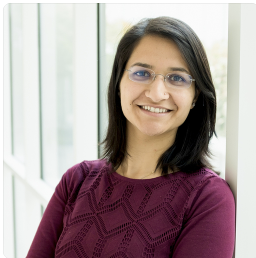

The inundation of data generation technologies, along with progress in Artificial Intelligence (AI) and increasing privacy concerns, has prompted research into techniques for both federated and privacy preserving AI. Federated Learning (FL) allows multiple clients to collaborate in training AI models without sharing data while privacy preserving AI places further emphasis on protecting client data. To date, federated and privacy preserving AI are primarily driven by consumer demand for fast and accurate analysis on personal devices which may contain sensitive data. In the HPC domain, FL interest has grown in the areas of health analytics and coordination across experimental facilities. This latter form of FL relaxes traditional assumptions such as including far fewer clients while increasing the amount of computational power available which poses new and unsolved problems. This workshop aims to highlight research in all aspects of federated and privacy preserving AI for HPC, machine learning, and scientific participants. Broad goals would be to consolidate the community around a core set of objectives or metrics and foster new collaborations.

## Workshop Organizer:

### Georgia Tourassi
*Division Director, Oak Ridge National Laboratory (ORNL)*

Georgia (Gina) Tourassi is the Director of the National Center for Computational Sciences and the Oak Ridge Leadership Computing Facility at Oak Ridge National Laboratory. She joined ORNL in 2011 as the director of the Biomedical Sciences and Engineering Center after a long academic career in the department of radiology and the medical physics graduate program at Duke University Medical Center. In addition, she is an adjunct professor of radiology at Duke University and the University of Tennessee Graduate School of Medicine, joint UT-ORNL faculty of Mechanical, Aerospace, and Biomedical Engineering at the University of Tennessee at Knoxville and the Bredesen Center.

Dr. Tourassi’s research background and interests are in artificial intelligence, scalable data-driven biomedical discovery, high-performance computing, clinical decision support, and human-computer interaction. Her scholarly work includes more than 250 peer-reviewed journal articles, conference proceedings articles, book chapters, editorials, and conference abstracts[^1] as well as 15 invention disclosures and patents. 

### Eric Lançon
*Brookhaven National Laboratory*

Dr. Eric Lancon is the Director of the Scientific Data and Computing Center at Brookhaven National Laboratory. He worked at CERN (European Laboratory for Particle Physics, Geneva, Switzerland), where he held leadership positions in computing for the Large Hadron Collider (LHC). He developed international project s on distributed computing in China, Japan, and Romania.  He has interests in data management and data science. He obtained a Ph.D. in particle physics.

### Irina Rish
*Université de Montréal*

Irina Rish is a Full Professor in the Computer Science and Operations Research Department at the Université de Montréal (UdeM), and a core member of Mila - Quebec AI Institute. She holds a Canada Excellence Research Chair (CERC) in Autonomous AI and a Canadian Institute for Advanced Research (CIFAR) Canada AI Chair. Dr Rish received her MSc and PhD in AI from University of California, Irvine and MSc in Applied Mathematics from Moscow Gubkin Institute. Before joining UdeM in 2019, Irina was a research scientist at the IBM T.J. Watson Research Center, where she worked on various projects at the intersection of neuroscience and AI, and led the Neuro-AI challenge. She received multiple IBM awards, including IBM Eminence & Excellence Award and IBM Outstanding Innovation Award in 2018, IBM Outstanding Technical Achievement Award in 2017, and IBM Research Accomplishment Award in 2009. Dr. Rish holds 64 patents, has published over 70 peer-reviewed research papers, several book chapters, three edited books, and a monograph on Sparse Modeling.

### Prerna Dogra

pdogra@nvidia.com, Nvidia Corporation

### Massimo Mascaro

Techical Director, Applied AI, Google Inc.

Massimo is part of the Office of the CTO for Google Cloud and, in this role, he helps Google Cloud customers reimagine their businesses by leveraging the power of AI and the products from Google that enable it. Prior to Google he worked at Intuit where he founded and led the data science group as chief data scientist and director of data engineering. Massimo also worked as lead of R&D at Intellisis, a San Diego startup that builds advanced speech processing software for various US government and defense entities. Prior to that he was at Microsoft, both in the Core Ranking team for Bing and in the Technical Computing Team. Massimo started in theoretical physics and has a PhD in Computational Neuroscience. In his research work he studied the dynamics of large recurrent neural networks, their connections with attention and the ability of networks to mesh signals from different modalities.

### Feiyi Wang

Group Leader, Analytics and AI Methods at Scale, Oak Ridge National Laboratory

Feiyi Wang received his Ph.D. in Computer Engineering from North Carolina
State University (NCSU). Prior joining the Oak Ridge National Laboratory
(ORNL), he was a principal research scientist at Microelectronic Center of
North Carolina (MCNC) and the lead PI and Co-PI for several DARPA-funded
projects. He is a currently a Senior Research Scientist and the Group Leader
of Analytics and AI methods at Scale Group (AAIMS) at National Center for
Computational Sciences of ORNL. His research interests include large-scale
data analytics, distributed machine learning and scalable benchmarking, high
performance storage system, parallel I/O and file systems.  Dr. Wang held
Joint Faculty Professor of ECE Department, Bredesen Center Faculty position at
University of Tennessee. He is also a Senior Member of IEEE.

## Workshop Scope:

Our workshop will aim to gather stakeholders from academia, federal agencies, industry, and national laboratories to present state-of-the-art research and technologies for federated and privacy-preserving AI in HPC. We will lead and facilitate discussions on problems facing and solutions discovered for developing and researching federated learning systems, such as balancing the trade-offs between model accuracy, data privacy, and overall computational performance. The workshop will include presentations on attacks on data privacy in distributed systems, differential privacy, domain and task-specific algorithms, etc. as well as real-world applications of privacy preserving AI. Other questions for this burgeoning community include (1) what are potential collaborative and open HPC platforms and technologies for researchers and application engineers to leverage; (2) what are key metrics of success for these applications; and (3) how will the long-term security of these systems be maintained and ensured. 

## Speakers

### Jaideep Vaidya
*Distinguished Professor, Rutgers University*

Jaideep Vaidya is a Distinguished Professor in the MSIS Department at Rutgers University. He received the B.E. degree in
Computer Engineering from the University of Mumbai, the M.S. and Ph.D. degree in Computer Science from Purdue University.
His general area of research is in security, privacy, data mining, and data management. He has published over 200
technical papers in peer-reviewed journals and conference proceedings, and has received several best paper awards from
the premier conferences in data mining, databases, digital government, security, and informatics. He is an ACM
Distinguished Scientist, an IEEE Fellow and is the Editor in Chief of the IEEE Transactions on Dependable and Secure
Computing.

### Prerna Dogra
*Senior Manager for Healthcare AI, NVIDIA*

Prerna Dogra is a Senior Manager for Healthcare AI Products at NVIDIA, where she leads the collaborative open-source
Project MONAI and Nvidia Federated Learning. She is responsible for productizing domain specialized developer platforms,
enabling researchers and data scientists to transform the Healthcare imaging industry with technology for real-time
analysis, artificial intelligence, and advanced visualization. Prerna is passionate about driving GPU Computing to
Healthcare and building an open ecosystem of collaborative partners.

### Ravi K Madduri
*Research Scientist, Argonne National Laboratory*

Ravi is a computer scientist in the Data Science and Learning division at Argonne National Laboratory and at the
University of Chicago Consortium for Advanced Science and Engineering. He is an innovation fellow at the Polsky Center
of Entrepreneurship at University of Chicago. Ravi led several successful large projects in NSF, NIH and DOE. His
research interests are in building sustainable, scalable services for science, reproducible research, development of
Privacy-enhancing technologies, large-scale data management and analysis using AI and HPC. Ravi leads the DOE-funded
PALISADE-X project that is developing the Argonne PPFL (APPFL) framework that uses differentially private (DP)
algorithms for training federated learning (FL) models with the biomedical datasets from multiple organizations. Ravi
plays an important role in applying large-scale data analysis, deep learning to problems in biology. For his work on
“Cancer Moonshot” project, he received the Department of Energy Secretary award in 2017

### Kenny Cha
*Assistant Director, U.S. Food and Drug Administration (FDA)*

Kenny H. Cha is the Assistant Director for Software and High-Performance Computing in the Division of Imaging,
Diagnostics, and Software Reliability within the U.S. Food and Drug Administration, Center for Devices and Radiological
Health, where he leads the CDRH HPC team. He earned his B.S.E, M.S.E, and Ph.D. degrees from the University of Michigan
in Biomedical Engineering. His research interests include artificial intelligence, machine learning, and deep learning
for medical data, computer-aided diagnosis, and radiomics, with a focus on performance assessment, and taking advantage
of the HPC to enable these research.

### Patricia Florssi
*Technical Director, Google Cloud*

Patricia Florissi is a Technical Director at the Office of the CTO at Google Cloud. As a member of the Office of the
CTO, Patricia leads collaborative innovation projects with customers, working on disruptive technologies. Patricia
specializes in data engineering, federated analytics and federated learning, and analytics of data at large scale,
specially machine learning. Patricia earned a Ph. D. in computer science from Columbia University in New York, graduated
valedictorian with an M.B.A. at the Stern Business School in New York University, and has a Master’s and a Bachelor’s
degree in computer science from the Universidade Federal de Pernambuco, in Brazil.

### Ryan Adamson
*Group Leader, ORNL*
HPC Cybersecurity and Information Engineering, ORNL

Ryan leads the HPC Security and Information Engineering Group at the Oak Ridge Leadership Computing Facility (OLCF). His group is responsible for delivering highly-scalable and reliable security services and telemetry platforms to the high-performance computing resources and staff at the OLCF.  His background in Linux systems administration at scale helps him understand the nuances of system complexity when developing solutions to security and operational mandates. Overall, Ryan enjoys tackling technical challenges and tries to find creative ways to safely and efficiently enable research when OLCF security policy, technical computational limitations, or other roadblocks chafe against the OLCF research mission.  He holds a masters degree in computer science from the University of Tennessee and previously was a certified GIAC Exploit Researcher And Advanced Penetration Tester (GXPN). He is currently pursuing a PhD in Engineering from Tennessee Tech University with a focus on the challenges overlapping the HPC and Security disciplines.

## Agenda
Nov 14, 2022 (Dallas, TX local time)

|                   | Speaker          | Title                                                                                                                                |
|------------------:|------------------|--------------------------------------------------------------------------------------------------------------------------------------|
| 8:30AM - 8:35AM   | Georgia Tourassi | Opening Remarks                                                                                                                      |
| 8:35AM - 9:15AM   | Jaideep Vaidya   | Privacy-preserving Data Sharing and Analytics   *An HPC perspective*                                                             |
| 9:15AM - 9:40AM   | Prerna Dogra     | TBD                                                                                                                                  |
| 9:40AM - 10:05AM  | Ravi K Madduri   | Application of Privacy Preserving Federated Learning in Biomedical applications   *Lessons learned from the PALISADE-X project*  |
| 10:05AM - 10:30AM | Kenny Cha        | HPC at the FDA   *Data reuse concepts for AI*                                                                                    |
| 10:30AM - 10:55AM | Patricia Florssi | Federated Computations and the Digital Rights Movement                                                                               |
| 10:55AM - 11:20AM | Ryan Adamson     | Securing Federated Learning Capabilities Within an Exascale Environment                                                                                                                                  |
| 11:20AM - 12:00PM | Panel Discussion |                                                                                                                                      |

 

--------------------------------------------------------------------
[^1]: <https://scholar.google.com/citations?user=O_0diUoAAAAJ&hl=en>
