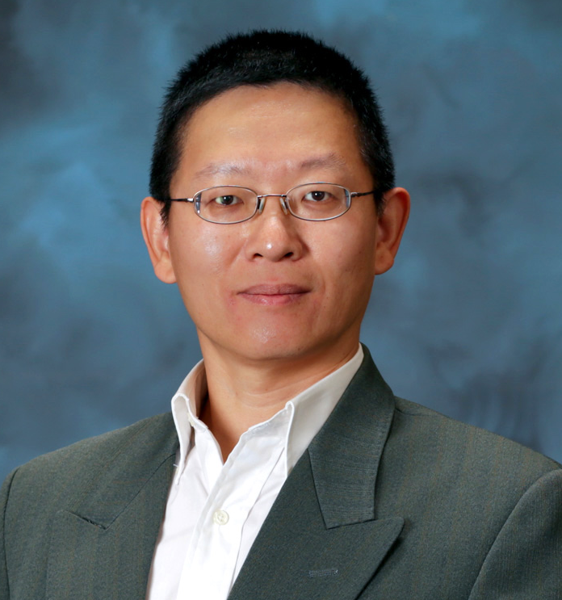
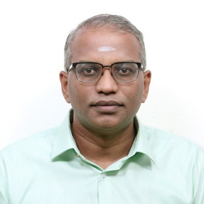
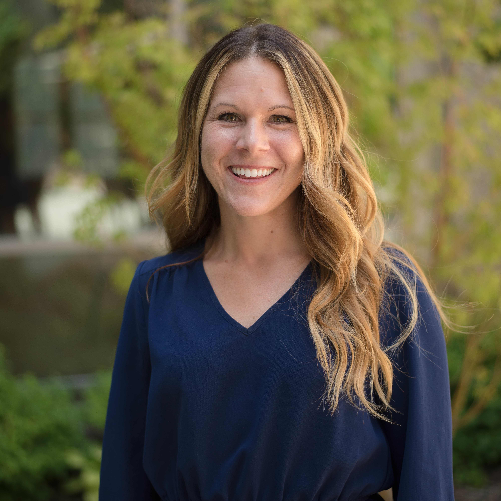

The inundation of data generation technologies, along with progress in Artificial Intelligence (AI) and increasing privacy concerns, has prompted research into techniques for both federated and privacy preserving AI. Federated Learning (FL) allows multiple clients to collaborate in training AI models without sharing data while privacy preserving AI places further emphasis on protecting client data. To date, federated and privacy preserving AI are primarily driven by consumer demand for fast and accurate analysis on personal devices which may contain sensitive data. In the HPC domain, FL interest has grown in the areas of health analytics and coordination across experimental facilities. This latter form of FL relaxes traditional assumptions such as including far fewer clients while increasing the amount of computational power available which poses new and unsolved problems. This workshop aims to highlight research in all aspects of federated and privacy preserving AI for HPC, machine learning, and scientific participants. Broad goals would be to consolidate the community around a core set of objectives or metrics and foster new collaborations.

## Workshop Organizer:

### Georgia Tourassi
*Division Director, Oak Ridge National Laboratory (ORNL)*

Georgia (Gina) Tourassi is the Director of the National Center for Computational Sciences and the Oak Ridge Leadership Computing Facility at Oak Ridge National Laboratory. She joined ORNL in 2011 as the director of the Biomedical Sciences and Engineering Center after a long academic career in the department of radiology and the medical physics graduate program at Duke University Medical Center. In addition, she is an adjunct professor of radiology at Duke University and the University of Tennessee Graduate School of Medicine, joint UT-ORNL faculty of Mechanical, Aerospace, and Biomedical Engineering at the University of Tennessee at Knoxville and the Bredesen Center.

Dr. Tourassi’s research background and interests are in artificial intelligence, scalable data-driven biomedical discovery, high-performance computing, clinical decision support, and human-computer interaction. Her scholarly work includes more than 250 peer-reviewed journal articles, conference proceedings articles, book chapters, editorials, and conference abstracts[^1] as well as 15 invention disclosures and patents. 

### Eric Lançon
*Brookhaven National Laboratory*

Dr. Eric Lancon is the Director of the Scientific Data and Computing Center at Brookhaven National Laboratory. He worked at CERN (European Laboratory for Particle Physics, Geneva, Switzerland), where he held leadership positions in computing for the Large Hadron Collider (LHC). He developed international project s on distributed computing in China, Japan, and Romania.  He has interests in data management and data science. He obtained a Ph.D. in particle physics.

### Irina Rish
*Université de Montréal*

Irina Rish is a Full Professor in the Computer Science and Operations Research Department at the Université de Montréal (UdeM), and a core member of Mila - Quebec AI Institute. She holds a Canada Excellence Research Chair (CERC) in Autonomous AI and a Canadian Institute for Advanced Research (CIFAR) Canada AI Chair. Dr Rish received her MSc and PhD in AI from University of California, Irvine and MSc in Applied Mathematics from Moscow Gubkin Institute. Before joining UdeM in 2019, Irina was a research scientist at the IBM T.J. Watson Research Center, where she worked on various projects at the intersection of neuroscience and AI, and led the Neuro-AI challenge. She received multiple IBM awards, including IBM Eminence & Excellence Award and IBM Outstanding Innovation Award in 2018, IBM Outstanding Technical Achievement Award in 2017, and IBM Research Accomplishment Award in 2009. Dr. Rish holds 64 patents, has published over 70 peer-reviewed research papers, several book chapters, three edited books, and a monograph on Sparse Modeling.

### Feiyi Wang
*Group Leader, Analytics and AI Methods at Scale, Oak Ridge National Laboratory*

Feiyi Wang received his Ph.D. in Computer Engineering from North Carolina
State University (NCSU). Prior joining the Oak Ridge National Laboratory
(ORNL), he was a principal research scientist at Microelectronic Center of
North Carolina (MCNC) and the lead PI and Co-PI for several DARPA-funded
projects. He is a currently a Senior Research Scientist and the Group Leader
of Analytics and AI methods at Scale Group (AAIMS) at National Center for
Computational Sciences of ORNL. His research interests include large-scale
data analytics, distributed machine learning and scalable benchmarking, high
performance storage system, parallel I/O and file systems.  Dr. Wang held
Joint Faculty Professor of ECE Department, Bredesen Center Faculty position at
University of Tennessee. He is also a Senior Member of IEEE.

## Workshop Scope:

Our workshop will aim to gather stakeholders from academia, federal agencies, industry, and national laboratories to present state-of-the-art research and technologies for federated and privacy-preserving AI in HPC. We will lead and facilitate discussions on problems facing and solutions discovered for developing and researching federated learning systems, such as balancing the trade-offs between model accuracy, data privacy, and overall computational performance. The workshop will include presentations on attacks on data privacy in distributed systems, differential privacy, domain and task-specific algorithms, etc. as well as real-world applications of privacy preserving AI. Other questions for this burgeoning community include (1) what are potential collaborative and open HPC platforms and technologies for researchers and application engineers to leverage; (2) what are key metrics of success for these applications; and (3) how will the long-term security of these systems be maintained and ensured. 

## Speakers

### Jian Liu
*Assistant Professor, The University of Tennessee*

Jian Liu is an Assistant Professor in the Min H. Kao Department of Electrical Engineering and Computer Science at The University of Tennessee, Knoxville (UTK). He leads Mobile Sensing and Intelligence Security (MoSIS) Lab @ UTK. Before joining UTK, Dr. Liu received his Ph.D. degree from Rutgers, The State University of New Jersey. His research interests span Robust and Trustworthy AI and ML, Mobile Security, Mobile and Wearable Computing, and Smart Healthcare. His research work has been published at top-tier security/mobile-computing/HCI/AI venues (e.g., ACM MobiCom, IEEE S&P, ACM CCS, CVPR, AAAI, ECCV, ACM MobiSys, ACM SenSys, ACM UbiComp, and ICASSP) and has been regularly featured in the media including BBC News, Yahoo News, MIT Technology Review, NBC New York, IEEE Spectrum, WCBS TV, and Voice of America TV, etc. He is the recipient of multiple awards, including two Best Paper Awards at IEEE SECON 2017 and IEEE CNS 2018, ACM SigMobile Research Highlights 2022, and ECE Graduate Program Academic Achievement Award at Rutgers, etc. He also filed six U.S. patents, two of which have been licensed to industrial companies. For more information, please refer to his homepage at: <https://web.eecs.utk.edu/~jliu/>

### Sathyanarayanan Manamohan
*Hewlett-Packard Enterprise*

Sathyanarayanan Manamohan is a Master technologist with the Advanced Development Center in Hewlett-Packard Enterprise. He is the co-inventor of the Swarm Learning decentralized federated learning platform. He has 23 years of industry expertise in Query optimization in parallel and distributed database environments, Federated Machine learning and Blockchain technology. He has completed in his master’s in software systems. Has several patents in the decentralized machine learning and computation. His areas of work and research include Machine Learning, Federated machine learning and Explainable AI.

### Heidi Hanson
*Senior Scientist, Advanced Computing for Health Sciences, Oak Ridge National Laboratory*

Heidi is the Group Lead of Biostatistics and Biomedical Informatics at Oak Ridge National Laboratory. She leads the DOE-NCI Modeling Outcomes using Surveillance Data and Scalable Artificial Intelligence for Cancer (MOSSAIC) partnership, focused on advancing computing, predictive machine learning/deep learning models, and large-scale computational simulations for NCI-supported cancer research. Her research interests include developing computational tools that facilitate population-scale health research.  

### Ryan Coffee
*Senior Scientist, SLAC National Accelerator Laboratory*

Ryan Coffee is Senior Staff Research Scientist and has been leading R&D for basic energy science at the world's premiere x-ray free electron laser at SLAC since its inception in 2009.  He is driving an integrative approach to instrumentation and co-design of computing across the portfolio of Department of Energy labs and facilities, from diagnostic and detector development to algorithms and computing, from the sensor Edge to Leadership Computing Facilities.  Atomic, molecular, and optical physics is Ryan's scientific origin and continues to serve as his proving ground for high-speed streaming data interpretation and information extraction and the optimal co-design of compute and sensor hardware.  By exploring spin off applications, like his LCLS femtosecond timing solution utilized for improving resolution in PET imaging, there is an emerging need for cross-discipline secure federated machine learning with data and model provenance tracking which has come to be one of Ryan's core foci.  Outside of SLAC, Ryan serves on the advisory board of the non-profit, Enterprise Neurosystem, a community leveraging open-source and maker-friendly technologies to help ensure climate, agricultural, and economic resilience to emerging global challenges domestically and internationally through partnerships across the technology sector and with the USDA, the Department of State, and the UN.

## Agenda
Nov 14, 2022 (Dallas, TX local time)

|                   | Speaker                   | Title                                                                              |
|------------------:|---------------------------|------------------------------------------------------------------------------------|
| 8:30AM - 8:35AM   | Georgia Tourassi          | Opening Remarks                                                                    |
| 8:35AM - 9:15AM   | Jian Liu                  | Behind Closed Doors: Exploring Privacy Vulnerabilities in Federated Learning       |
| 9:15AM - 9:40AM   | Sathyanarayanan Manamohan | Swarm Learning – Privacy preserving decentralized machine learning                 |
| 9:40AM - 10:05AM  | Heidi Hanson              | Federated Learning with Healthcare Data at Scale                                   |
| 10:05AM - 10:30AM | Ryan Coffee               | Toward a Secure Federated Infrastructure for AI-Accelerated Multi-Facility Science |
| 10:30AM - 10:55AM | TBD                       | TBD                                                                                |
| 10:55AM - 11:20AM | TBD                       | TBD                                                                                |
| 11:20AM - 12:00PM | Panel Discussion          |                                                                                    |

 

--------------------------------------------------------------------
[^1]: <https://scholar.google.com/citations?user=O_0diUoAAAAJ&hl=en>
